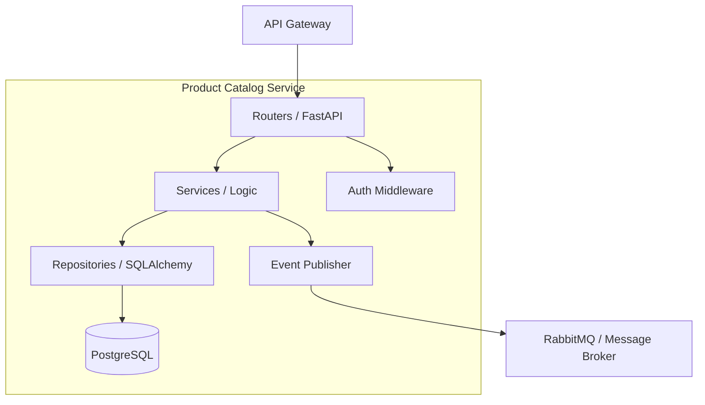
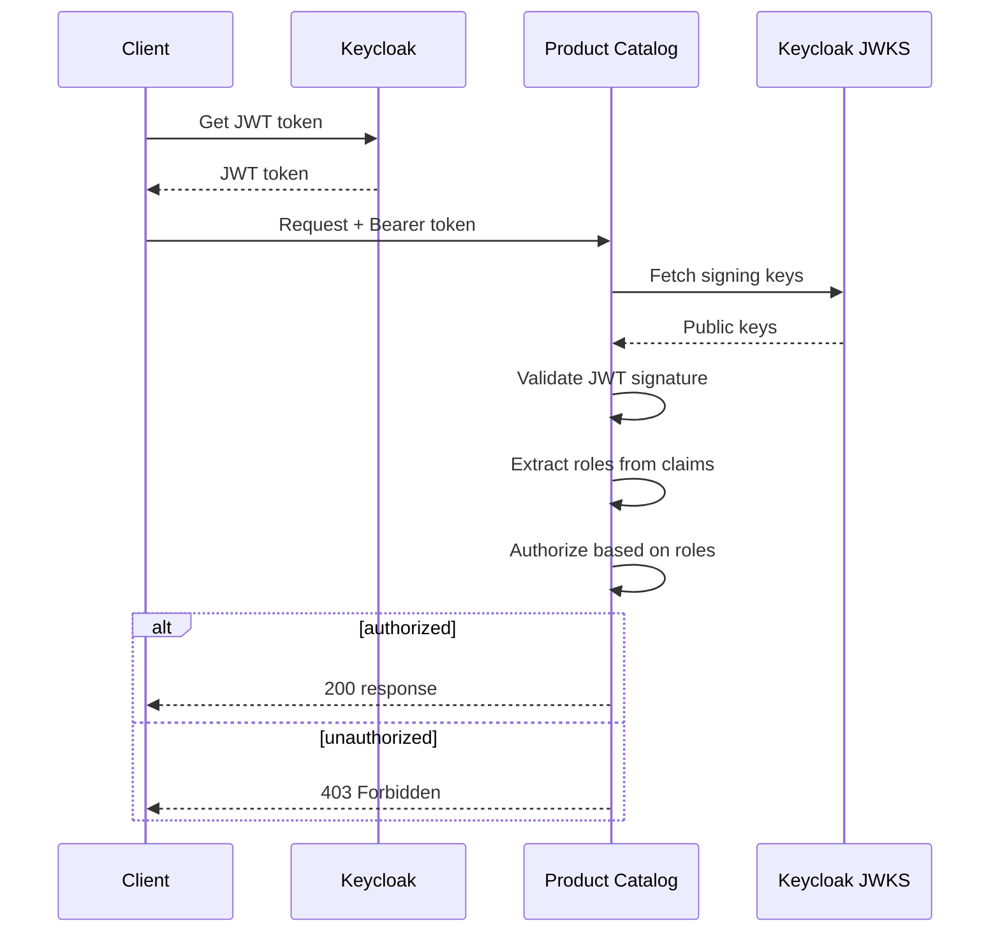

# Product Catalog Service Architecture

## Overview

The Product Catalog Service is a FastAPI-based microservice responsible for managing product information in the Shopping Cart platform. It provides RESTful APIs for product CRUD operations, category management, and search functionality.

## Technology Stack

| Component | Technology | Version |
|-----------|------------|---------|
| Runtime | Python | 3.11+ |
| Framework | FastAPI | 0.109+ |
| Database | PostgreSQL | 15+ |
| ORM | SQLAlchemy | 2.0+ |
| Migrations | Alembic | 1.13+ |
| Message Queue | RabbitMQ | 3.12+ |

## Architecture Diagram



## Project Structure

```
shopping-cart-product-catalog/
├── src/
│   └── product_catalog/
│       ├── __init__.py
│       ├── main.py              # FastAPI application entry
│       ├── config.py            # Configuration management
│       ├── auth.py              # OAuth2/OIDC authentication
│       ├── models/              # SQLAlchemy models
│       │   ├── product.py
│       │   └── category.py
│       ├── schemas/             # Pydantic schemas
│       │   ├── product.py
│       │   └── category.py
│       ├── routers/             # API route handlers
│       │   ├── products.py
│       │   └── categories.py
│       ├── services/            # Business logic
│       │   ├── product_service.py
│       │   └── category_service.py
│       └── repositories/        # Data access layer
│           ├── product_repo.py
│           └── category_repo.py
├── tests/
│   ├── unit/
│   └── integration/
├── alembic/                     # Database migrations
├── docs/
└── k8s/                         # Kubernetes manifests
```

## Component Details

### Routers (API Layer)
- **products.py**: Product CRUD endpoints
- **categories.py**: Category management endpoints
- Request validation using Pydantic
- Dependency injection for services

### Services (Business Logic)
- **ProductService**: Product operations, validation, business rules
- **CategoryService**: Category hierarchy management

### Repositories (Data Layer)
- **ProductRepository**: Product database operations
- **CategoryRepository**: Category database operations
- SQLAlchemy async sessions

### Authentication
- **OIDCAuth**: Keycloak JWT validation
- **CurrentUser**: User context extraction from JWT
- Role-based access control (RBAC)

## Data Model

### Product Entity

```python
class Product(Base):
    id: UUID
    name: str
    description: str
    sku: str
    price: Decimal
    category_id: UUID
    inventory_count: int
    is_active: bool
    created_at: datetime
    updated_at: datetime
```

### Category Entity

```python
class Category(Base):
    id: UUID
    name: str
    description: str
    parent_id: Optional[UUID]
    path: str  # Materialized path for hierarchy
    created_at: datetime
```

## Security Architecture

### Authentication Flow



### Role-Based Access

| Role | Permissions |
|------|-------------|
| catalog-user | Read products, categories |
| catalog-admin | CRUD products, categories |
| platform-admin | Full access + admin operations |

### Security Middleware

```python
# Security headers added by middleware
X-Content-Type-Options: nosniff
X-Frame-Options: DENY
X-XSS-Protection: 1; mode=block
Content-Security-Policy: default-src 'self'
```

## Configuration

### Environment Variables

| Variable | Description | Default |
|----------|-------------|---------|
| `DATABASE_URL` | PostgreSQL connection string | - |
| `RABBITMQ_HOST` | RabbitMQ host | localhost |
| `OAUTH2_ENABLED` | Enable OAuth2 | false |
| `OAUTH2_ISSUER_URI` | Keycloak issuer URI | - |
| `OAUTH2_CLIENT_ID` | OAuth2 client ID | product-catalog |
| `LOG_LEVEL` | Logging level | INFO |

### Configuration Loading

```python
from pydantic_settings import BaseSettings

class Settings(BaseSettings):
    database_url: str
    oauth2_enabled: bool = False
    oauth2_issuer_uri: str = ""

    class Config:
        env_file = ".env"
```

## Event Publishing

### Events Published

| Event | Exchange | Routing Key | Payload |
|-------|----------|-------------|---------|
| ProductCreated | catalog.events | product.created | Product JSON |
| ProductUpdated | catalog.events | product.updated | Product JSON |
| ProductDeleted | catalog.events | product.deleted | {id: UUID} |
| InventoryChanged | catalog.events | inventory.changed | {id, count} |

## Performance Considerations

### Database Optimization
- Connection pooling with SQLAlchemy async
- Indexed columns: sku, category_id, is_active
- Pagination for list endpoints

### Caching Strategy
- JWKS caching (5 minute TTL)
- Category tree caching (optional)

### Async Processing
- All database operations use async/await
- Background tasks for event publishing

## Related Documentation

- [API Reference](../api/README.md)
- [Troubleshooting Guide](../troubleshooting/README.md)
- [Development Guide](../guides/development.md)
